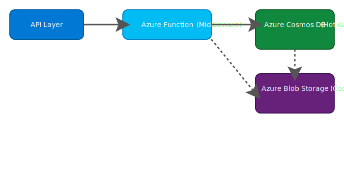

# Azure Cost Optimization Solution – Billing Records in Serverless Architecture

## Problem Statement

We operate a serverless system in Azure with billing records stored in Azure Cosmos DB. It’s read-heavy, but records older than 3 months are rarely accessed. Cosmos DB costs have grown due to the 2M+ records, some as large as 300KB, and long-term retention requirements.

## Goals

| Requirement                      | Description                                                                 |
|----------------------------------|-----------------------------------------------------------------------------|
| Simplicity                      | Easy to deploy & maintain                                                   |
| No Data Loss / Downtime         | Seamless migration, no service disruption                                   |
| No API Changes                  | Existing API read/write behavior must not change                            |
| Cost Optimization               | Reduce Cosmos DB storage & RU/s cost                                        |
| Cold Data Availability          | Archived records must still be retrievable within a few seconds             |

## Solution: Tiered Storage Using Azure Blob Storage

### Architecture Overview



## Cost Optimization Strategy

- Keep recent records (≤ 90 days) in Cosmos DB
- Archive older records (> 90 days) in Azure Blob Storage (Cool/Archive Tier)
- Implement fallback logic to serve old records from Blob if missing in Cosmos

## Archival Logic (Azure Function – Timer Trigger)

Use an Azure Function to periodically migrate old records:

```python
from azure.cosmos import CosmosClient
from azure.storage.blob import BlobServiceClient
import datetime, json

# Config
COSMOS_CONTAINER = "billing"
BLOB_CONTAINER = "cold-billing-records"
ARCHIVE_AGE_DAYS = 90

# Clients
cosmos = CosmosClient.from_connection_string("COSMOS_CONN_STRING")
blob_service = BlobServiceClient.from_connection_string("BLOB_CONN_STRING")

def archive_old_records():
    today = datetime.datetime.utcnow()
    cutoff = today - datetime.timedelta(days=ARCHIVE_AGE_DAYS)
    container = cosmos.get_database_client("db").get_container_client(COSMOS_CONTAINER)
    
    query = f"SELECT * FROM c WHERE c.timestamp < '{cutoff.isoformat()}'"
    for record in container.query_items(query, enable_cross_partition_query=True):
        record_id = record['id']
        
        # Archive to Blob
        blob_client = blob_service.get_blob_client(container=BLOB_CONTAINER, blob=f"{record_id}.json")
        blob_client.upload_blob(json.dumps(record), overwrite=True)
        
        # Delete from Cosmos
        container.delete_item(record_id, partition_key=record['partitionKey'])
Read Fallback Logic
python
Copy
Edit
def get_billing_record(record_id, partition_key):
    try:
        return cosmos_container.read_item(record_id, partition_key)
    except NotFoundError:
        blob_client = blob_service.get_blob_client(container=BLOB_CONTAINER, blob=f"{record_id}.json")
        if blob_client.exists():
            data = blob_client.download_blob().readall()
            return json.loads(data)
        else:
            raise RecordNotFoundException()
Zero Downtime Transition Plan
Deploy new read logic with fallback to Blob Storage

Start archival job (batch ≤ 10k/day)

Enable monitoring

Gradually clean Cosmos DB records >90 days

Summary Table
Feature / Constraint   Met?    Solution
Simplicity             Yes     Serverless Azure Function, native storage solution
No Data Loss / Downtime Yes    Gradual migration, no user impact
API Contracts Unchanged Yes    Access logic is hidden, API remains the same
Cost Optimization      Yes     Blob Storage is 90%+ cheaper than Cosmos DB
Access Latency (Old Data) Yes  Blob retrieval in seconds
Maintenance Overhead   Yes     Low - uses native Azure services
Security / Compliance  Yes     Blob versioning, managed identity, RBAC, logging

Optional Enhancements
Enhancement Description
Blob Index Tags        Faster filtering/search for archived data
Blob Lifecycle Policies Auto-transition from Cool to Archive tier
CDN/Edge Cache         Cache recently accessed cold data
Observability (App Insights) Monitor fallback access frequency/latency
IaC (Bicep/Terraform)  Full infra deployment and config management
